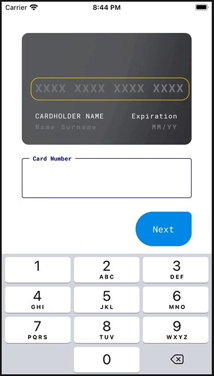
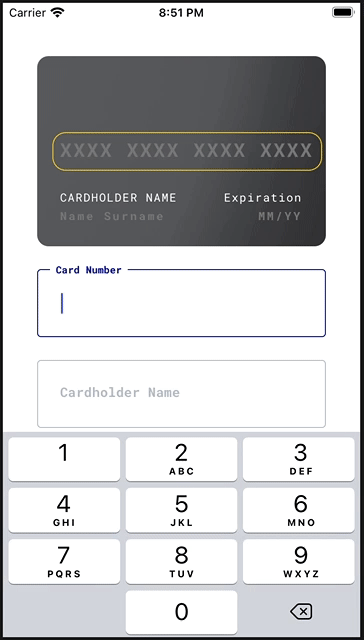

# React Native Credit Card

This is a fully functional and animated credit card form library, and it's ready to use 🚀



---

## Features

- Works on iOS and Android.
- Validations.
- Card icon animation with `Lottie`.
- Card flip animation with [react-native-card-flip](https://github.com/lhandel/react-native-card-flip).
- Possible to access all `react-hook-form` methods.
- TypeScript code base.
- Works on `Expo`.

## Blog Post

This repository also contains my initial work of building a simple react native form with `react-hook-form` without any fancy animations. You may read it on my blog: [React Native Form Management Tutorial](https://bilir.me/blog/react-native-form-management-tutorial).

## Installation

Install the library first:

```
npm install rn-credit-card
// OR
yarn add rn-credit-card
```

Install `react-hook-form`:

```
npm install react-hook-form
// OR
yarn add react-hook-form
```

You also need to install `lottie-react-native` if you want to display card icon animations. Please note that this is optional, and the library will display simple card icons if `Lottie` is not present:

```
npm install lottie-react-native
// OR
yarn add lottie-react-native
```

If you'd like to use the library on Android, make sure you're using a `lottie-react-native` version greater than `3.0.0`. The animations are not working on `2.x.x` versions.

Additional steps might be needed depending on your platform. Please check [lottie-react-native documentation](https://github.com/lottie-react-native/lottie-react-native#installing-react-native--0600).

### Configuring Fonts

The library uses [Roboto Mono](https://fonts.google.com/specimen/Roboto+Mono) font by default. If you'd like to keep it that way, you need to import `RobotoMono_400Regular` and `RobotoMono_700Bold` fonts to your project. Please see [Expo](https://docs.expo.io/versions/latest/sdk/font/) or [this dev.to post](https://dev.to/aneeqakhan/add-custom-fonts-in-react-native-0-63-for-ios-and-android-3a9e) for more information.

You may also use custom fonts with this library. Please see [#fonts](#fonts) section.

## Usage

You need to create a `react-hook-form` and pass it down to the `CreditCardForm` through `FormProvider` context. This structure helps you accessing every propery and method of the form so you can build some features on top of the library.

The library is written in TypeScript, and types are also available out of the box. You may use `FormModel` to type your form.

Here is a fully functional example with `KeyboardAvodingView`, which manages the scroll position when keyboard is open.

```tsx
import React from 'react'
import { FormProvider, useForm } from 'react-hook-form'
import {
  Alert,
  StyleSheet,
  KeyboardAvoidingView,
  Platform,
  SafeAreaView,
} from 'react-native'
import LottieView from 'lottie-react-native'
import CreditCardForm, { Button, FormModel } from 'rn-credit-card'

const App: React.FC = () => {
  const formMethods = useForm<FormModel>({
    // to trigger the validation on the blur event
    mode: 'onBlur',
    defaultValues: {
      holderName: '',
      cardNumber: '',
      expiration: '',
      cvv: '',
    },
  })
  const { handleSubmit, formState } = formMethods

  function onSubmit(model: FormModel) {
    Alert.alert('Success: ' + JSON.stringify(model, null, 2))
  }

  return (
    <FormProvider {...formMethods}>
      <SafeAreaView style={styles.container}>
        <KeyboardAvoidingView
          style={styles.avoider}
          behavior={Platform.OS === 'ios' ? 'padding' : 'height'}
        >
          <CreditCardForm
            LottieView={LottieView}
            horizontalStart
            overrides={{
              labelText: {
                marginTop: 16,
              },
            }}
          />
        </KeyboardAvoidingView>
        {formState.isValid && (
          <Button
            style={styles.button}
            title={'CONFIRM PAYMENT'}
            onPress={handleSubmit(onSubmit)}
          />
        )}
      </SafeAreaView>
    </FormProvider>
  )
}

const styles = StyleSheet.create({
  container: {
    flex: 1,
  },
  avoider: {
    flex: 1,
    padding: 36,
  },
  button: {
    margin: 36,
    marginTop: 0,
  },
})

export default App
```

If you are not using TypeScipt on your project, simply remove `FormModel` references from the example above.

## Available Props

### LottieView

This prop takes the default exported value of `lottie-react-native` library. This is optional because `Lottie` might require additional configuration steps. The library will display simple png card icons if this prop is not provided.

Please remember you need a `lottie-react-native` version greater than `3.x.x` to make it work on Android.

| type | default   | required | platform    |
| ---- | --------- | -------- | ----------- |
| any  | undefined | NO       | iOS/Android |

Example:

```tsx
import LottieView from 'lottie-react-native'
;<CreditCardForm LottieView={LottieView} />
```

### horizontalStart

This makes the form start with a horizontal scroll. This is the default behaviour.

This feature is not working on Android due to a weird problem happening when the `ScrollView` is switched from `horizontal`.

| type    | default | required | platform |
| ------- | ------- | -------- | -------- |
| boolean | true    | NO       | iOS only |

This is the outcome when `horizontalStart` is `false`:



### backgroundImage

You may use this prop to replace the background image of the card preview.

| type            | default   | required | platform    |
| --------------- | --------- | -------- | ----------- |
| React.ReactNode | undefined | NO       | iOS/Android |

Example:

```tsx
<CreditCardForm
  backgroundImage={
    <Image
      style={{
        position: 'absolute',
        width: '100%',
        height: '100%',
        borderRadius: 12,
      }}
      source={background}
    />
  }
/>
```

### fonts

`fonts` props take an object with two fields:

| field         | type   | default               | required |
| ------------- | ------ | --------------------- | -------- |
| fonts.regular | string | RobotoMono_400Regular | NO       |
| fonts.bold    | string | RobotoMono_700Bold    | NO       |

Please note that you should use a [Monospaced font](https://en.wikipedia.org/wiki/Monospaced_font) for the best user experience. The fixed width helps maintaining the same card number width while the user types.

Example:

```tsx
<CreditCardForm
  fonts={{
    regular: 'RobotoMono_400Regular',
    bold: 'RobotoMono_700Bold',
  }}
/>
```

### inputColors

You may modify the `TextInput` colors using this. It's an object with three optional fields:

| field   | type   | default | required |
| ------- | ------ | ------- | -------- |
| focused | string | #080F9C | NO       |
| errored | string | #B00020 | NO       |
| regular | string | #B9C4CA | NO       |

Example:

```tsx
<CreditCardForm
  inputColors={{
    focused: '#080F9C',
    errored: '#B00020',
    regular: '#B9C4CA',
  }}
/>
```

### translations

An optional object that takes a string for each displayed text on the library. You may use it to modify any or all of those displayed texts.

| type         | default   | required | platform    |
| ------------ | --------- | -------- | ----------- |
| Translations | undefined | NO       | iOS/Android |

Example:

```tsx
<CreditCardForm
  // those are the default values
  translations={{
    cardNumber: 'Card Number',
    cardHolderName: 'Cardholder Name',
    nameSurname: 'Name Surname',
    mmYY: 'MM/YY',
    expiration: 'Expiration',
    securityCode: 'Security Code',
    next: 'Next',
    done: 'Done',
    cardNumberRequired: 'Card number is required.',
    cardNumberInvalid: 'This card number looks invalid.',
    cardHolderNameRequired: 'Cardholder name is required.',
    cardHolderNameInvalid: 'This cardholder name looks invalid.',
    expirationRequired: 'Expiration date is required.',
    expirationInvalid: 'This expiration date looks invalid.',
    securityCodeRequired: 'Security code is required.',
    securityCodeInvalid: 'This security date looks invalid.',
  }}
/>
```

### overrides

This props might be used to override some component styles within the library. All fields are optional.

| field             | type                   |
| ----------------- | ---------------------- |
| cardPreview       | ViewStyle or TextStyle |
| labelText         | TextStyle              |
| cardHolderPreview | TextStyle              |
| expirationPreview | ViewStyle or TextStyle |
| outline           | ViewStyle              |
| input             | ViewStyle              |
| labelContainer    | ViewStyle              |
| inputLabel        | TextStyle              |
| errorText         | TextStyle              |

### Credits

- The design is from [Pawel Szymankiewicz](https://dribbble.com/shots/6440077-Add-a-New-Credit-Card-alternate-flow).
- Card icon animations are from [Tim John](https://lottiefiles.com/timjohn).
